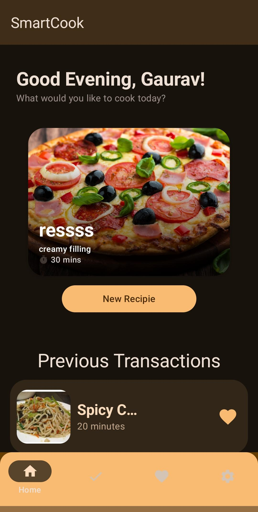
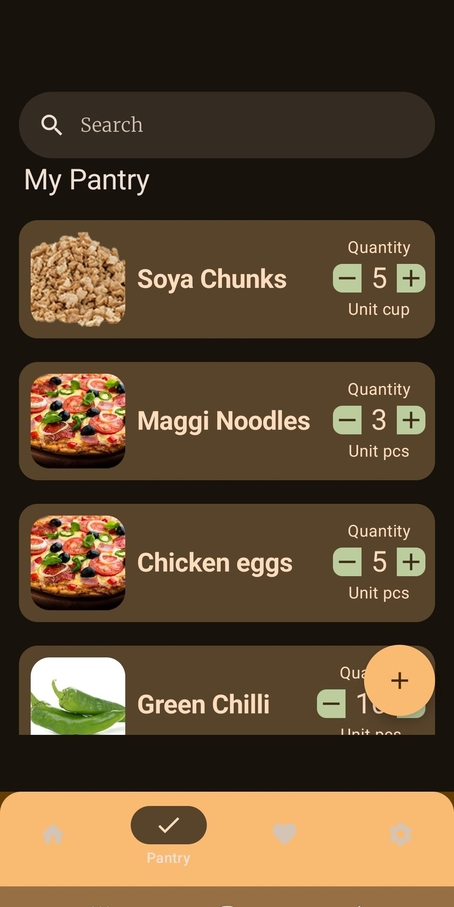
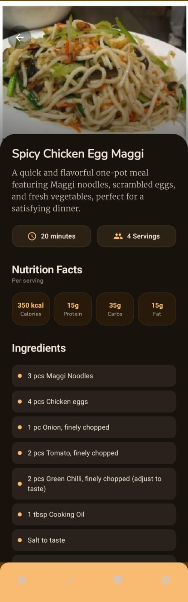
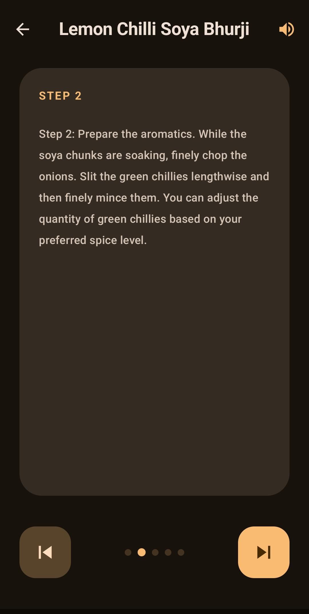
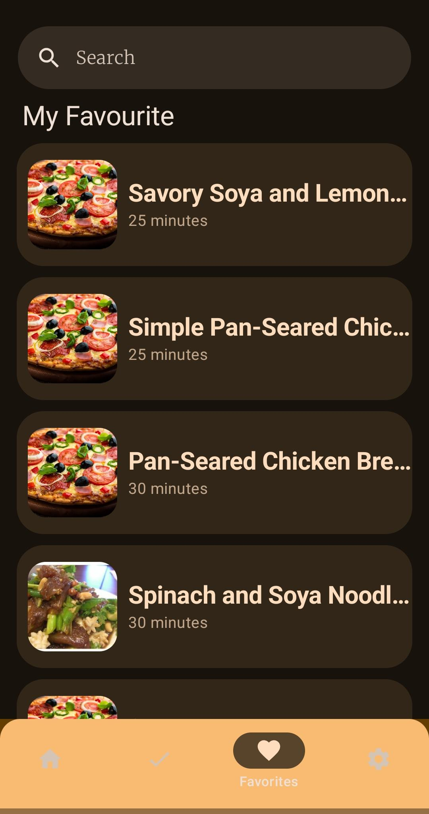
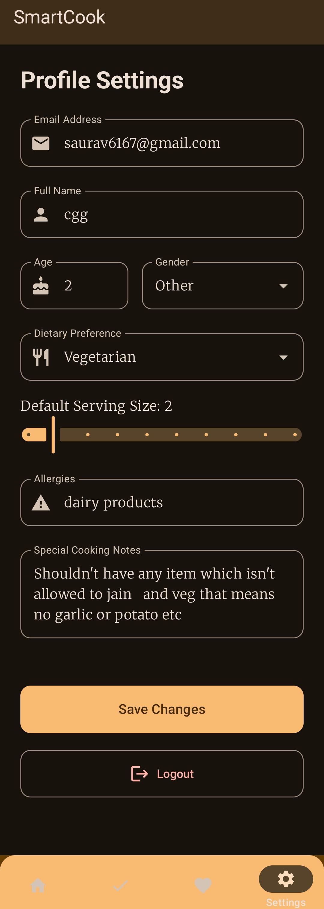

# Smart Cook: AI-Powered Recipe Companion

Smart Cook is a modern Android application designed to eliminate "what should I cook today?" fatigue. By leveraging the Gemini API, the app analyzes your current pantry inventory to suggest creative, delicious, and healthy recipes, ensuring you make the most of what you already have.

## 📸 Screenshots

<p align="center">
  
  
  
</p>

<p align="center">
  
  
  
</p>

**Note**:-  The pizza image is used for where no image cant be found through spoonacular api

## 🚀 Features

### Currently Implemented
*   **Secure Authentication:** Firebase-powered login and registration system.
*   **Inventory Management:** A dedicated module to add, update, and track available ingredients in your kitchen using Room Database.
*   **Modern UI Architecture:** Built entirely with Jetpack Compose for a fluid, reactive user interface.
*   **Core Navigation:** Established structure for Home, Inventory, Favorites, and Settings.
*   **AI Recipe Generation:** Integrated Gemini 1.5 Flash for intelligent recipe suggestions based on pantry items.
*   **Step-by-Step Cooking:** Immersive full-screen UI for following recipe instructions.


## 🛠 Tech Stack
*   **Language:** Kotlin
*   **UI Framework:** Jetpack Compose (Material 3)
*   **Database:** Room (Local Storage)
*   **Backend:** Firebase (Auth, Firestore)
*   **AI:** Google Gemini API (Firebase AI SDK)
*   **Dependency Injection:** Hilt
*   **Architecture:** MVVM (Model-View-ViewModel)

## 📋 Roadmap to "Resume Ready" (May 2026)
To ensure the project is at a professional standard for internship applications, the following milestones are prioritized:
1.  **Phase 1: The Core Loop** – Finalize the prompt engineering for Gemini to ensure recipe accuracy and formatting.
2.  **Phase 2: Data Persistence** – Fully integrate the Favorites module so users don't lose great recipes.
3.  **Phase 3: Visual Appeal** – Connect ingredient image APIs to make the inventory look professional.
4.  **Phase 4: Optimization** – Implement proper error handling for API quotas and offline states.

## ⚙️ Setup & Installation
1.  **Clone the repository:**
    ```bash
    git clone https://github.com/your-username/smart-cook.git
    ```
2.  **Open the project** in Android Studio (Ladybug or newer).
3.  **Add your `google-services.json`** for Firebase to the `app/` folder.
4.  **Sync Gradle** and run on an emulator or physical device.

## 🤝 Contributing
Since this is a personal project aimed at skill development, suggestions are welcome! Feel free to open an issue or submit a pull request.
